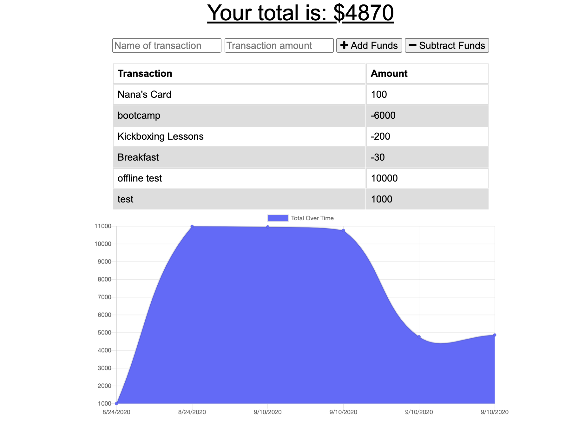
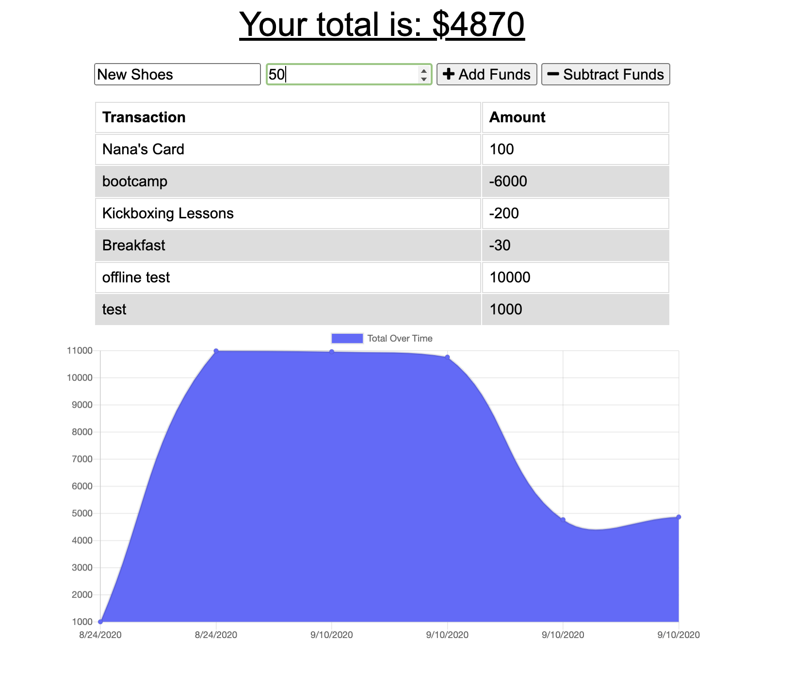
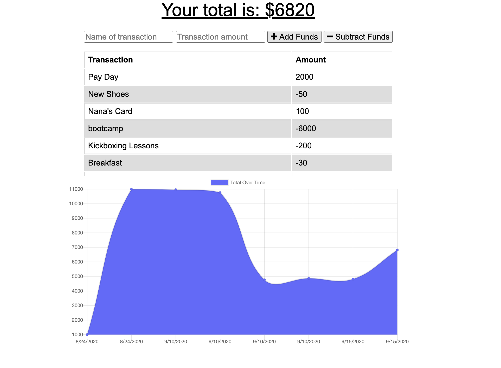
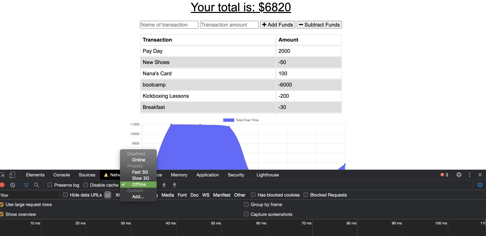

# On/Offline Budget Tracker
## Table of Contents 
* [Deployed Site](#deployed-site)
*  [Description](#description)
*  [Usage Instructions](#usage-instructions)
*  [Technologies Used](#technologies-used)
*  [Have Questions?](#have-questions)

## Deployed Site

    https://immense-falls-16600.herokuapp.com/

## Description

    This app allows the user to keep track of their finances by entering transactions into the input field and watching as their budget changes accordingly. They can either add or subtract funds and the changes overtime are reflected on a graph.

## Usage Instructions

    When the user opens the app, they will find a page that looks similar to this. 

    To create a transaction, the user types in the input fields at the top. The field on the left is where the user labels what the transaction is for. The field on the right is where the user lists the dollar amount of the transaction.

    The two buttons next to it will both submit the transaction. The "add funds" will translate the amount in the right field as a positive amount on the table and graph. The "subtract funds" button translates the amount in the right input field as a negative amount on the table and graph. 

    All functionality above can be accomplished offline as well. Once the network is reestablished, all transactions will still be reflected on the app. 

## Technologies Used

    Express, JavaScript, Node.js, service worker

## Have Questions?
    Contact me!
    GitHub username: anderam17
    Email: allana.anderson17@gmail.com